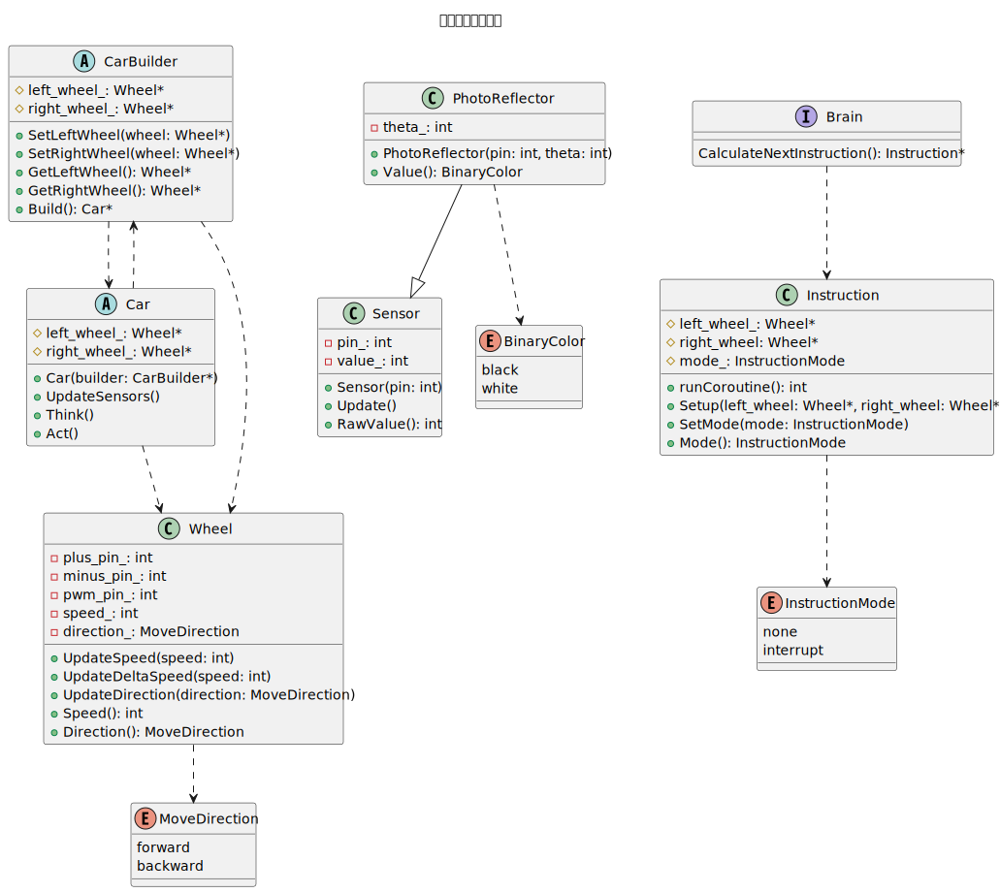
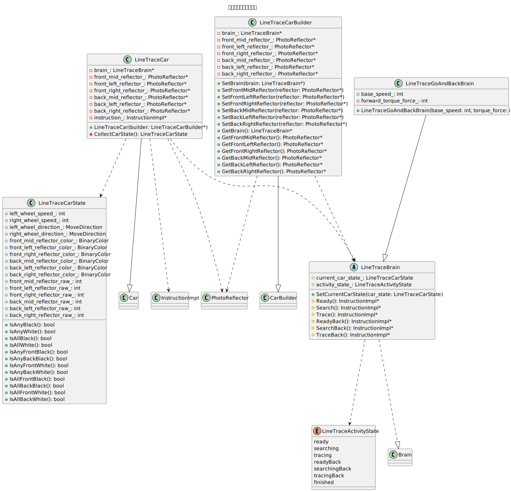
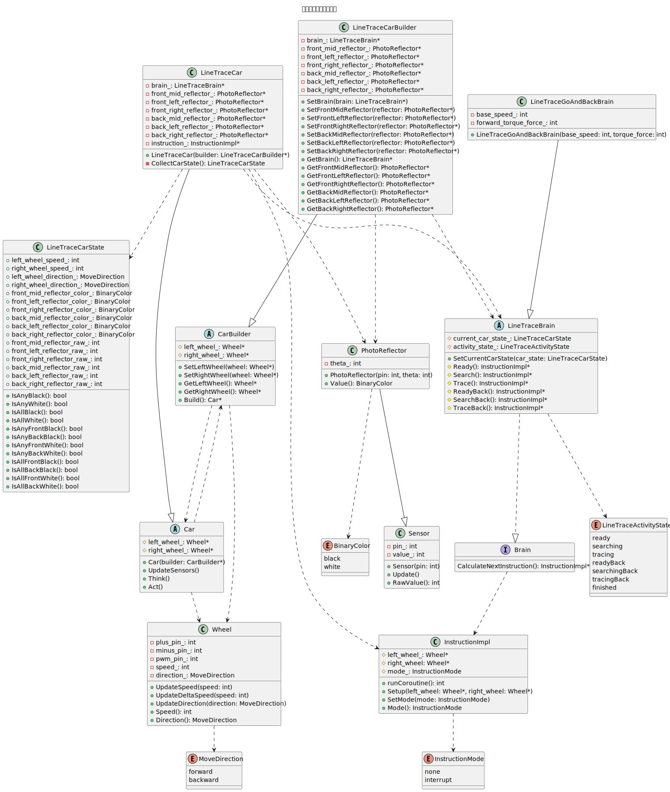

# 情報工学実験III 作業リポジトリ

情報工学実験IIIで扱うソフトウェアをチームで開発する作業リポジトリです。

## 開発ガイドライン

- `develop`ブランチには直接コミットしない（ブランチを切って作業しよう！）
- コミットメッセージには加えた変更を完結にわかりやすく書く

## 作業フロー

1. `develop`から`feature/xxxx`ブランチを切る
2. `feature/xxxx`内で機能開発を進める
3. 完成したら`develop`に向けてPull Requestを作成・レビュー依頼
4. 指摘された箇所を修正
5. Approve（承認）を貰ったら自分で`develop`にマージ

### 補足

- `feature/xxxx`の`xxxx`は適当な名前。何のタスクをやっているのか想像しやすい命名にしよう。例）`feature/line_trace_algorithm` など
- Pull Requestは作業完了前に作成しても構いません。互いにタスクの進み具合を把握するためにも、Pull Requestを発行した状態で作業を進めていくことを推奨します。

## 使用ツール

強制はしませんが、下記のツールを使用することを推奨します。

- JetBrains CLion (https://www.jetbrains.com/clion/)
- PlatformIO (https://platformio.org/)

Arduino IDEでも可能ではありますが、セットアップが面倒なので非推奨です。

## トラブルシューティング
- ヘッダーファイル内のインクルードにエラーが出てしまう。
    - `platformio init --board uno`を走らせてみてください。多分消えると思う。
    - 上記でも無理ならCLionのプロジェクトを再作成するとき、当プロジェクトのフォルダを選択した状態で、PlatformIOプロジェクト（Arduino Uno）を「Create from Existing Sources」すれば解消されるかも。

## アーキテクチャ

プログラムのアーキテクチャ・設計思想に関して説明します。※クラス図は少し古いバージョンの可能性があります。実際の設計は微妙に異なるかもしれません。

### コア機能`core`のクラス図

コア機能は非常に簡素な作りをしており、最低限の実装が行われています。基本的にこのcoreライブラリを拡張する形でプログラムを実装していきます。各クラスに関して簡単に説明します。

- `Car`: 実際のハードウェア（車）に対応するクラスです。 左車輪`left_wheel_`と右車輪`right_wheel_`から成ります。
- `Wheel`: タイヤを抽象化したクラスです。速度や回転方向の取得・更新を行うインタフェースを提供します。
- `CarBuilder`: 車のインスタンス生成を容易にするための補助クラスです。
- `Sensor`: センサー値の更新・提供を行うクラスです。
- `PhotoReflector`: `Sensor`クラスを拡張し2値(`BinaryColor`)でデータを取得できるようにしたクラスです。
- `Brain`: アルゴリズム実装部のクラスとなります。
- `InstructionImpl`: `Brain`クラスは必ずこの`InstructionImpl`のインスタンスを命令として返します。
- `InstructionMode`: 割り込み実行の可否を決定します。`none`→空きがあれば実行, `interrupt`→割り込み実行（強制実行）

### アプリケーションのライフサイクル

- `setup`で`CarBuilder`を用いて`Car`インスタンスを生成します。
- `loop`で`Car->UpdateSensors()`→`Car->Think()`→`Car->Act()`の順で実行します。

`loop`での処理について補足説明をしますが、
- `UpdateSensors`では、センサー情報の更新を行います。
- `Think`では、次の行動を決定します。
- `Act`では、`Think`で決定した行動を実行に移します。

`Car`クラスは抽象クラスであるため、これら3つの関数は`virtual`で宣言されています。具体的な実装方法に関しては`LineTraceBrain`などを確認するといいでしょう。

### カスタム機能`custom`のクラス図

`custom`では、基本的に`core`クラスを拡張して実際の目的に沿った`Car`サブクラスを作っていきます。例えば、ライントレースするアルゴリズムに関して、クラス図は以下のようになります。

### 全体のクラス図

少し複雑ですが前述のクラス図2つを結合してできる全体のクラス図は以下のようになります。

